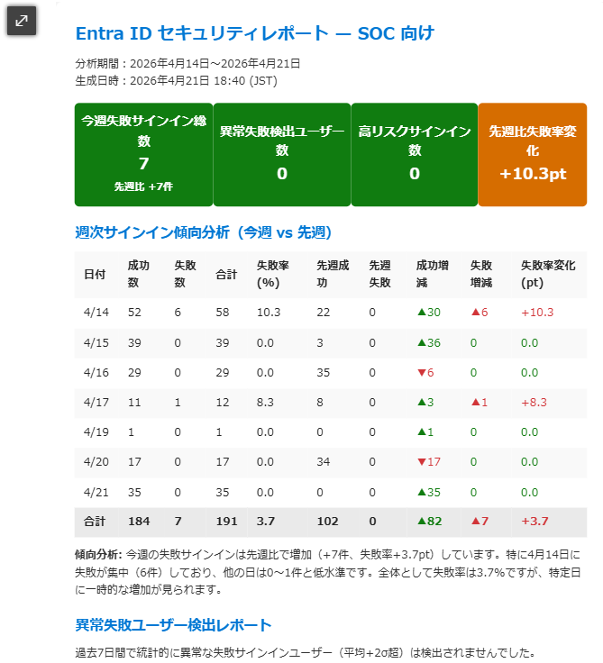

# Weekly Entra ID RiskUser Analytics Report

Microsoft Security Copilot 用カスタムエージェント。  
**Sentinel の SigninLogs テーブルを KQL で集計**し、先週比較の傾向分析と統計的異常ユーザー検出を含む SOC 向けレポートを生成して **Outlook メール**で通知します。  
検出されたユーザーには **Entra ID プラグインで氏名・役職・ロール情報を付与**し、特権アカウントの侵害兆候を可視化します。

---

## 概要

| 項目 | 内容 |
|---|---|
| **エージェント種別** | Standard Agent（スケジュール／手動トリガー型） |
| **使用モデル** | gpt-4.1 |
| **データソース** | Microsoft Sentinel（KQL）+ Entra ビルトインプラグイン |
| **通知方法** | Azure Logic App → Office 365 Outlook |
| **レポート形式** | HTML / CSS インラインスタイル（Meiryo フォント、メール互換） |
| **実行間隔** | 週次（604800 秒）または手動 |

---

## 通知画面イメージ

以下は、エージェントが生成した HTML レポートメールの画面例です。



> PNG ファイルを `images/` フォルダに `report_sample.png` として配置してください。

---

## アーキテクチャ

```
Security Copilot（週次スケジュール or 手動）
  └── SocReportOrchestrator (Agent / gpt-4.1)
        │
        ├── GetWeeklySignInTrend        ──▶ Sentinel KQL (SigninLogs)
        │     今週の日別サインイン成功・失敗集計 + 先週同曜日との増減列
        │
        ├── GetAnomalousFailedSignIns    ──▶ Sentinel KQL (SigninLogs)
        │     統計的異常ユーザー検出（平均+2σ超過）
        │
        ├── GetEntraData                ──▶ Entra プラグイン (Microsoft Graph)
        │     検出ユーザーの氏名・役職・部署・ディレクトリロール取得
        │
        ├── GetFailedSignInDetails      ──▶ Sentinel KQL (SigninLogs)
        │     失敗サインイン詳細（ユーザー/エラーコード/国/IP 別集計）
        │
        ├── GetRiskSignIns              ──▶ Sentinel KQL (SigninLogs)
        │     リスク付きサインイン＋高リスクサインイン詳細＋リスクユーザー抽出
        │
        └── [HTML レポート生成]
              ├── KPI カード ×4（先週比付き）
              ├── 週次サインイン傾向分析（今週 vs 先週）
              ├── 異常失敗ユーザー検出（氏名・役職・ロール付き）
              ├── 全体傾向分析・危険ユーザー兆候レポート
              ├── 失敗サインイン詳細・リスクイベント・リスクユーザー
              └── 推奨アクション（自動判定）
                    │
                    └── SendSocReportEmail
                          └── Azure Logic App ──▶ Outlook ──▶ SOC
```

---

## データソース

本エージェントは **Sentinel KQL** と **Entra プラグイン**のハイブリッド構成です。

| カテゴリ | スキル名 | データソース | 取得内容 |
|---|---|---|---|
| 傾向分析 | `GetWeeklySignInTrend` | Sentinel KQL | 今週の日別サインイン集計 + 先週同曜日との増減列（成功・失敗・失敗率） |
| 異常検出 | `GetAnomalousFailedSignIns` | Sentinel KQL | 平均+2σ超過の異常失敗ユーザー検出 |
| 失敗詳細 | `GetFailedSignInDetails` | Sentinel KQL | ユーザー/エラーコード/国/IP 別の失敗集計（上位100件） |
| リスクサインイン | `GetRiskSignIns` | Sentinel KQL | リスク付きサインイン + 高リスクサインイン詳細 + リスクユーザー抽出 |
| ユーザープロファイル | `GetEntraData` | Entra プラグイン | 検出ユーザーの氏名・役職・部署・ディレクトリロール |
| メール送信 | `SendSocReportEmail` | LogicApp | HTML レポートを Outlook メールで送信 |

---

## ファイル構成

```
WeeklyEntraIdRiskUserAnalyticsReport/
├── WeeklyEntraIdRiskUserAnalyticsReport.yaml      # エージェントマニフェスト（HTML メール通知版・Sentinel KQL）
├── WeeklyEntraIdRiskUserAnalyticsReport_md.yaml   # エージェントマニフェスト（Markdown 出力版・Entra プラグインのみ）
├── WeeklyEntraIdRiskUserAnalyticsReport_ARM.json  # Outlook 送信用 Logic App ARM テンプレート
├── WeeklyEntraIdRiskUserAnalyticsReport.html      # Plugin Card（参照用）
└── README.md
```

### 2 つのバージョン

| ファイル | データソース | 出力形式 | Logic App | 用途 |
|---|---|---|---|---|
| `WeeklyEntraIdRiskUserAnalyticsReport.yaml` | **Sentinel KQL** + Entra | HTML メール | **必要** | 先週比較・異常検出を含む SOC 通知 |
| `WeeklyEntraIdRiskUserAnalyticsReport_md.yaml` | Entra プラグインのみ | Markdown テキスト | 不要 | Sentinel 不要の簡易版 |

---

## ワークフロー（7 Step）

| Step | スキル | データソース | 内容 |
|---|---|---|---|
| 1 | `GetWeeklySignInTrend` | Sentinel KQL | 今週の日別サインイン集計 + 先週同曜日増減 |
| 2 | `GetAnomalousFailedSignIns` | Sentinel KQL | 統計的異常ユーザー検出 |
| 3 | `GetEntraData` | Entra プラグイン | 検出ユーザーの氏名・役職・部署・ロール取得 |
| 4 | `GetFailedSignInDetails` | Sentinel KQL | 失敗サインイン詳細集計 |
| 5 | `GetRiskSignIns` | Sentinel KQL | リスクサインイン + リスクユーザー抽出 |
| 6 | エージェント | — | HTML レポート生成 |
| 7 | `SendSocReportEmail` | LogicApp | Outlook メール送信 |

---

## 生成レポートの仕様

### デザイン
- **フォント**: Meiryo, 'メイリオ', 'Segoe UI', sans-serif
- **プライマリカラー**: #0078D4（Microsoft Blue）
- **レイアウト**: `<table>` ベース・CSS インラインスタイル（Outlook 完全互換）
- **幅**: max-width: 680px（メール表示最適化）
- **JavaScript / 外部 CDN**: 一切不使用（Outlook 互換のため）

### セクション構成

| セクション | 内容 |
|---|---|
| **ヘッダー** | タイトル・分析期間（過去7日間）・生成日時（JST） |
| **セクション 1** | KPI サマリーカード ×4（今週失敗数＋先週比・異常検出ユーザー数・リスクユーザー数・高リスクサインイン数） |
| **セクション 2** | **週次サインイン傾向分析**（今週7日分：成功数/失敗数/合計/失敗率 + 先週同曜日との増減列（▲▼色分け）+ サマリー行 + 傾向サマリー） |
| **セクション 3** | **異常失敗ユーザー検出レポート**（UPN / 氏名 / 役職 / ロール / 失敗数 / エラーコード / 国 / IP） |
| **セクション 4** | 全体傾向分析・危険ユーザー兆候レポート（事実ベース分析・推奨優先対応ユーザー一覧） |
| **セクション 5** | リスクイベント種別（イベント種別 / リスクレベル / 件数） |
| **セクション 6** | 失敗サインイン詳細（ユーザー / エラーコード / エラー理由 / 場所 / IP / 発生数） |
| **セクション 7** | 高リスクサインイン一覧（ユーザー / 日時 / アプリ / 国 / リスク詳細） |
| **セクション 8** | 推奨アクション（データに基づき自動判定） |
| **フッター** | 自動生成注記・エージェント名・日時 |

### 異常検出のロジック

| 項目 | 内容 |
|---|---|
| **検出基準** | 過去7日間の失敗サインイン数が全ユーザー平均 + 2標準偏差を超えるユーザー |
| **出力情報** | UPN / 氏名 / 役職 / 部署 / ディレクトリロール / 失敗数 / 閾値 / エラーコード / IP / 国 |
| **特権アカウント強調** | Global Admin、Security Admin 等のロールを持つユーザーは赤色ハイライト |

### エラーコード日本語説明

失敗サインイン詳細テーブルでは、Microsoft 公式ドキュメントに基づくエラーコードの日本語説明を付与します。  
公式リファレンス: https://learn.microsoft.com/ja-jp/entra/identity-platform/reference-error-codes

---

## 前提条件

| 要件 | 詳細 |
|---|---|
| Microsoft Security Copilot | ライセンス済み・有効化済み |
| Microsoft Sentinel | Entra サインインログが SigninLogs テーブルに取り込まれていること |
| Microsoft Entra プラグイン | Security Copilot で有効化済み |
| Entra ID P2 ライセンス | リスクユーザー・リスク検出機能に必要 |
| Azure サブスクリプション | Logic App のデプロイ先 |
| Office 365 ライセンス | Outlook 送信アカウント |

---

## セットアップ手順

### A. HTML メール通知版（`WeeklyEntraIdRiskUserAnalyticsReport.yaml`）

#### ステップ A-1 — Logic App ARM テンプレートのデプロイ

```bash
az deployment group create \
  --resource-group <YOUR-RESOURCE-GROUP> \
  --template-file WeeklyEntraIdRiskUserAnalyticsReport_ARM.json \
  --parameters emailAddress="soc-team@contoso.com"
```

#### ステップ A-2 — Office 365 API 接続の認証

```
Azure ポータル → リソースグループ → office365 (API 接続) → [接続の編集] → サインイン
```

#### ステップ A-3 — Security Copilot へのアップロード

1. [Security Copilot ポータル](https://securitycopilot.microsoft.com) にアクセス
2. 左メニュー **「プラグイン」** → **「カスタムプラグインをアップロード」**
3. `WeeklyEntraIdRiskUserAnalyticsReport.yaml` を選択してアップロード

#### ステップ A-4 — プラグイン設定

インストール後、プラグインの設定画面で以下の **7 項目**を入力します。

| 設定項目 | 内容 | 例 |
|---|---|---|
| **Logic App サブスクリプション ID** | Logic App の Azure サブスクリプション ID | `xxxxxxxx-xxxx-xxxx-xxxx-xxxxxxxxxxxx` |
| **Logic App リソースグループ** | Logic App のリソースグループ名 | `rg-securitycopilot` |
| **Logic App ワークフロー名** | Logic App のワークフロー名 | `SocReportEmailLogicApp` |
| **Sentinel サブスクリプション ID** | Sentinel の Azure サブスクリプション ID | `xxxxxxxx-xxxx-xxxx-xxxx-xxxxxxxxxxxx` |
| **Sentinel リソースグループ** | Sentinel ワークスペースのリソースグループ名 | `rg-sentinel` |
| **Sentinel ワークスペース名** | Log Analytics ワークスペース名 | `law-sentinel` |
| **Sentinel テナント ID** | Microsoft Entra テナント ID | `xxxxxxxx-xxxx-xxxx-xxxx-xxxxxxxxxxxx` |

#### ステップ A-5 — 動作確認

Security Copilot のエージェント画面から対象エージェントを選択し、**「今すぐ実行」** をクリックします。

### B. Markdown 出力版（`WeeklyEntraIdRiskUserAnalyticsReport_md.yaml`）

Sentinel 不要・Logic App 不要の簡易版です。

1. [Security Copilot ポータル](https://securitycopilot.microsoft.com) にアクセス
2. `WeeklyEntraIdRiskUserAnalyticsReport_md.yaml` をアップロード
3. PowerAutomate から呼び出すか、手動で実行して Markdown レポートを取得

---

## スケジュール実行について

本エージェントは `DefaultPollPeriodSeconds: 604800`（7日間）で**週次自動実行**するよう設定されています。  
初回有効化後、Security Copilot が自動的に週次スケジュールを開始します。

---

## トラブルシューティング

| 症状 | 確認ポイント |
|---|---|
| Logic App がトリガーされない | プラグイン設定の Logic App 名・リソースグループ・サブスクリプション ID を確認 |
| メールが届かない | Azure ポータルで `office365` API 接続の認証状態を確認 |
| KQL スキルでエラー | Sentinel 設定（テナント ID・サブスクリプション ID・リソースグループ・ワークスペース名）を確認 |
| SigninLogs テーブルにデータがない | Entra 管理センター → 監視 → 診断設定 で SigninLogs の Log Analytics 転送を確認 |
| リスクユーザーが常に 0 件 | Entra ID P2 ライセンスが割り当てられているか確認 |
| `GetEntraRiskyUsers` で権限エラー | 本バージョンでは使用しません。KQL の `GetRiskSignIns` でリスク情報を取得 |
| `GetEntraData` でユーザー情報取得失敗 | エージェントはスキップして UPN のみでレポートを生成 |

---

## ライセンス

MIT License

---

## 関連リンク

- [Microsoft Security Copilot ドキュメント](https://learn.microsoft.com/ja-jp/copilot/security/)
- [Security Copilot カスタムプラグイン](https://learn.microsoft.com/ja-jp/copilot/security/custom-plugins)
- [Microsoft Entra ID Protection](https://learn.microsoft.com/ja-jp/entra/id-protection/)
- [Microsoft Sentinel SigninLogs](https://learn.microsoft.com/ja-jp/azure/azure-monitor/reference/tables/signinlogs)
- [Entra ID エラーコード](https://learn.microsoft.com/ja-jp/entra/identity-platform/reference-error-codes)
- [Azure Logic Apps](https://learn.microsoft.com/ja-jp/azure/logic-apps/)
